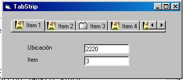



## TabStrip with images

### Description

TabScript que cambia las imagenes al pasar el cursor por los items.., cualquier mejora me la envian al correo :))
 
### More Info
 

             |
---                |---
**Submitted On**   |2003-06-09 11:25:56
**By**             |[Carlos Olaya](https://github.com/Planet-Source-Code/PSCIndex/blob/master/ByAuthor/carlos-olaya.md)
**Level**          |Intermediate
**User Rating**    |4.7 (14 globes from 3 users)
**Compatibility**  |VB 6\.0
**Category**       |[Coding Standards](https://github.com/Planet-Source-Code/PSCIndex/blob/master/ByCategory/coding-standards__1-43.md)
**World**          |[Visual Basic](https://github.com/Planet-Source-Code/PSCIndex/blob/master/ByWorld/visual-basic.md)
**Archive File**   |[TabStrip\_w162686892003\.zip](https://github.com/Planet-Source-Code/carlos-olaya-tabstrip-with-images__1-47553/archive/master.zip)

